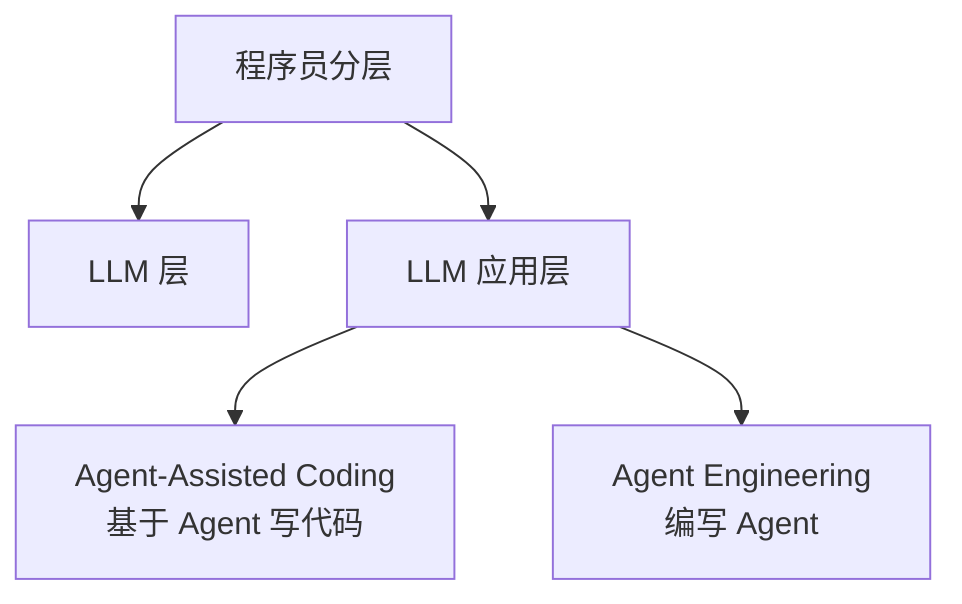

# 第 2 章 程序员分层与工程范式

## 学习目标

- 理解 AI 时代程序员正在发生怎样的分层
- 区分 `Vibe Coding` 和 `Agentic Engineering` 的不同层次
- 建立“写代码能力”与“组织 AI 生产能力”之间的差别意识

## 核心内容

如果把 AI 时代的程序员重新归类，可以先从两层看：`LLM 层` 和 `LLM 应用层`。这个划分不只是技术栈不同，而是你离模型本身、以及离真实生产系统的控制面，到底有多近。

`LLM 层` 更偏底层认知，重点是理解模型原理、能力边界、上下文窗口、推理与生成差异，以及评估方式。`LLM 应用层` 则更偏工程落地，重点是把模型接入真实业务、产品和工作流。在应用层内部，还可以继续分成两类：`Agent-Assisted Coding` 和 `Agent Engineering`。前者是把 Agent 当成写代码的生产工具，强调“基于 Agent 写代码”；后者是把 Agent 本身当成被设计、被编排、被交付的系统，强调“编写 Agent”。

这里就会引出第二个关键判断：`Vibe Coding 是人写代码的下限，Agentic Engineering 是人写代码的上限。` 这句话不是贬低 Vibe，而是在说它解决的是最低摩擦的实现问题。你描述一个感觉，AI 给你一段代码，这会显著提升起步速度。但如果你要交付一个复杂系统，仅靠 vibe 不够，因为复杂系统不是拼速度，而是拼边界、约束、验证和可维护性。

`Agentic Engineering` 则要求人从“实现者”切换为“编排者”。你要定义任务拆分、工具权限、上下文边界、失败处理和验收标准。换句话说，Vibe 更像一种快速生成手段，而 Agentic Engineering 更像一套系统化生产方式。

## 程序员分类

### 1. LLM 层

重点在模型原理、能力边界、上下文理解和评估方式。

### 2. LLM 应用层

重点在把模型接进真实业务、产品流程和工程体系。

#### 2.1 Agent-Assisted Coding

基于 Agent 写代码。重点是把 Agent 当作开发搭子、执行器和加速器，用它完成实现、重构、调试和交付。

#### 2.2 Agent Engineering

编写 Agent。重点是设计任务流、工具调用、状态控制、权限边界和验收机制，构建真正能帮助别人工作的 Agent 系统。

## 实践

结合你自己的工作，判断你当前更接近哪一层：

- 你当前更偏 `LLM 层`，还是 `LLM 应用层`？
- 如果在 `LLM 应用层`，你更接近 `Agent-Assisted Coding`，还是 `Agent Engineering`？
- 你现在是在使用 Agent 提升开发效率，还是在设计 Agent 让别人使用？

然后再回答：你现在的主要工作方式更接近 Vibe Coding，还是 Agentic Engineering？为什么？

## 小结

本章的重点是建立分层意识。AI 时代最重要的不是“会不会用某个模型”，而是你位于 `LLM 层` 还是 `LLM 应用层`，以及在应用层里你是在做 `Agent-Assisted Coding`，还是在做 `Agent Engineering`。